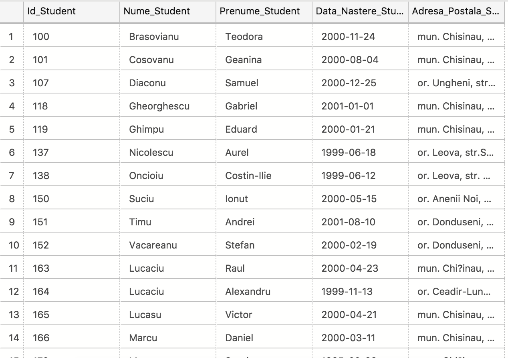
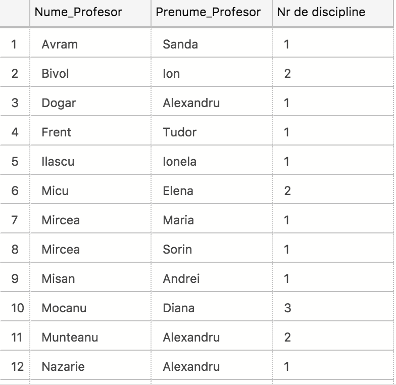
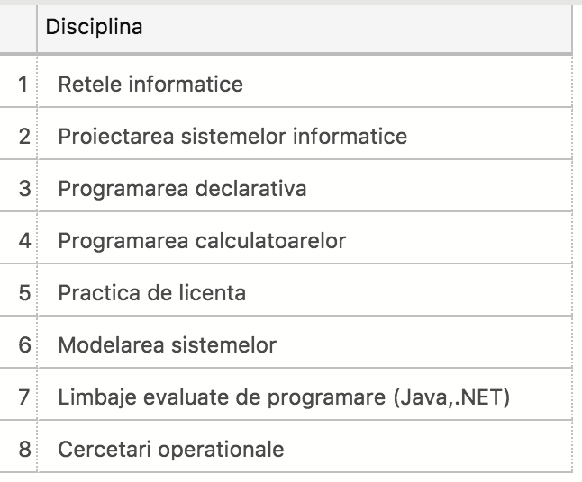

# Lab 4

## Control Questions
1. **What feautures does `SQL Transact-SQL Query Editor` offer?**
	* It lets us write `sql` queries and execute them in one place.
	* It also provides you with real time error checking and automomplete suggestions where possible.
	* It also lets you debug your `sql` queries.
2. **What do DDL, DML, DCL and TCL mean?**

	DDL(Data Definition Language) : DDL or Data Definition Language actually consists of the SQL commands that can be used to define the database schema. It simply deals with descriptions of the database schema and is used to create and modify the structure of database objects in database.

	## Examples of DDL commands:
	* **CREATE** is used to create the database or its objects (like table, index, function, views, store procedure and triggers).
	* **DROP**  is used to delete objects from the database.
	* **ALTER** is used to alter the structure of the database.
	* **TRUNCATE** is used to remove all records from a table, including all spaces allocated for the records are removed.
	* **COMMENT** is used to add comments to the data dictionary.
	* **RENAME** is used to rename an object existing in the database.
	* **DML(Data Manipulation Language)** The SQL commands that deals with the manipulation of data present in database belong to DML or Data Manipulation Language and this includes most of the SQL statements.

	## Examples of DML:
	* **SELECT** is used to retrieve data from the a database.
	* **INSERT** is used to insert data into a table.
	* **UPDATE** is used to update existing data within a table.
	* **DELETE** is used to delete records from a database table.
	* **DCL(Data Control Language)** DCL includes commands such as GRANT and REVOKE which mainly deals with the rights, permissions and other controls of the database system.

	## Examples of DCL commands:

	* **GRANT** gives user’s access privileges to database.
	* **REVOKE** withdraw user’s access privileges given by using the GRANT command.
	* **TCL(transaction Control Language)** TCL commands deals with the transaction within the database.

	## Examples of TCL commands:

	* **COMMIT** commits a Transaction.
	* **ROLLBACK** rollbacks a transaction in case of any error occurs.
	* **SAVEPOINT** sets a savepoint within a transaction.
	* **SET TRANSACTION** specify characteristics for the transaction.

3. **Transact SQL operations:**

    An operator is a symbol specifying an action that is performed on one or more expressions.
    - Arithmetic Operators
    - Logical Operators
    - Assignment Operator
    - Scope Resolution Operator
    - Bitwise Operators
    - Set Operators
    - Comparison Operators
    - String Concatenation Operator
    - Compound Operators
    - Unary Operators

4. **Basic SQL Select instruction syntax:**
    Retrieves rows from the database and enables the selection of one or many rows or columns from one or many tables in SQL Server. The full syntax of the SELECT statement is complex, but the main clauses can be summarized as:

        [ WITH { [ XMLNAMESPACES ,] [ <common_table_expression> ] } ]  
        SELECT select_list [ INTO new_table ]  
        [ FROM table_source ] [ WHERE search_condition ]  
        [ GROUP BY group_by_expression ]  
        [ HAVING search_condition ]  
        [ ORDER BY order_expression [ ASC | DESC ] ]  

5. **What are the Transact SQL funtions:**
  - **Aggregate functions:** Aggregate functions perform a calculation on a set of values and return a single value. They are allowed in the select list or the HAVING clause of a SELECT statement. You can use an aggregation in combination with the GROUP BY clause to calculate the aggregation on categories of rows.
  - **Analytic functions:** Analytic functions compute an aggregate value based on a group of rows. However, unlike aggregate functions, analytic functions can return multiple rows for each group.
  - **Ranking functions:** Ranking functions return a ranking value for each row in a partition. Depending on the function that is used, some rows might receive the same value as other rows.
  - **Rowset functions:** Rowset functions Return an object that can be used like table references in an SQL statement.
  - **Scalar functions:** Operate on a single value and then return a single value. Scalar functions can be used wherever an expression is valid.

6. **JOIN in MSSQL:**

   An SQL *JOIN* clause - combines columns from one or more tables in a relational database. It creates a set that can be saved as a table or used as it is. A JOIN is a means for combining columns from one (self-join) or more tables by using values common to each.
   SQL specifies five types of JOIN: **INNER**, **LEFT OUTER**, **RIGHT OUTER**, **FULL OUTER** and **CROSS**. As a special case, a table (base table, view, or joined table) can JOIN to itself in a self-join.

7. **How to limit results from SQL queries:**
MS SQL Server provides the top syntax that can be used in SQL select queries to limit the records returned from a query. This is especially useful when querying very large tables in cases where the user only cares about a subset of the records. Listed below are examples of how to use the top syntax.
 - `SELECT 20 PERCENT * FROM employee`
 - `SELECT TOP 100 * FROM employee`

## Practical assignments
### Task 5
Sa se afiseze lista studentilor al caror nume se termina in ,,u"

[Link to code](./src/ex5.sql) - 15 results.

### Task 22
Sa se obtina numaru de discipline predate de fiecare profesor (Nume_Profesor, Prenume_Profesor).

[Link to code](./src/ex22.sql) - 17 results.

### Task 23
Sa se obtina lista disciplinelor (Disciplina) sustinute de studenti cu nota medie de promovare la examen mai mare de 7, in ordine descrescatoare dupa denumirea disciplinei.

[Link to code](./src/ex23.sql) - 8 results.

### Task 24
Sa se afiseze lista disciplinelor (Disciplina) predata de cel putin 2 profi.

[Link to code](./src/ex24.sql) - 2 results.

