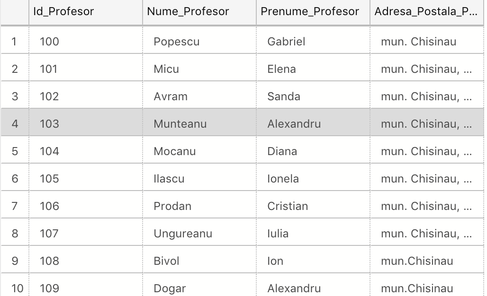
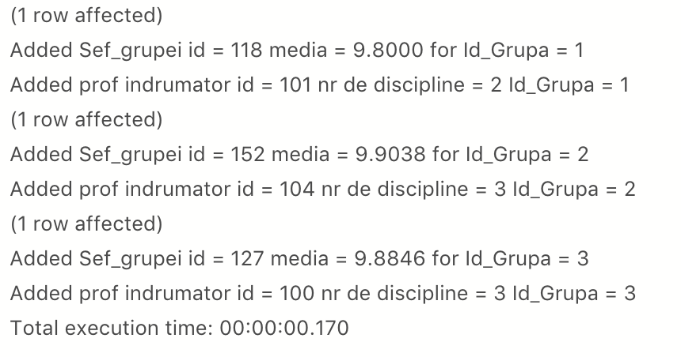
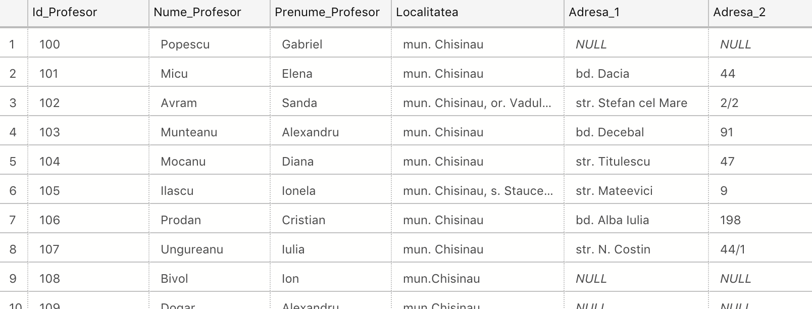
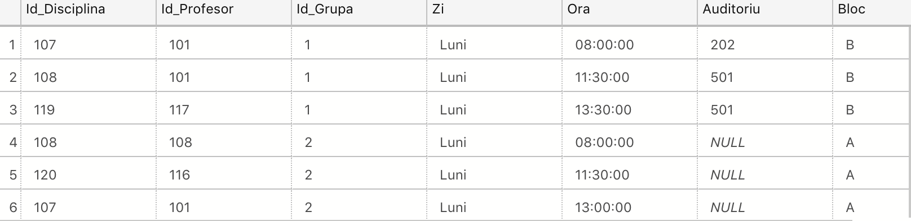

# Lab 6

## Task 1

[Code for task1](./src/task1.sql)

## Task 2

[Code for task2](./src/task2.sql)

## Task 3

[Code for task3](./src/task3.sql)

## Task 4

[Code for task4](./src/task4.sql)

## Task 5

[Code for task5](./src/task5.sql)

## Task 6

[Code for task6](./src/task6.sql)

## Task 7

[Code for task7](./src/task7.sql)

