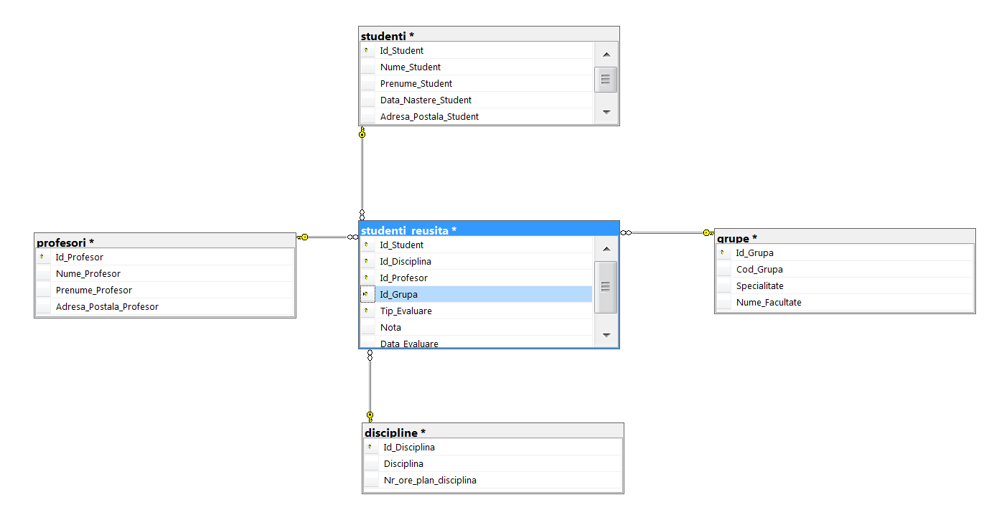
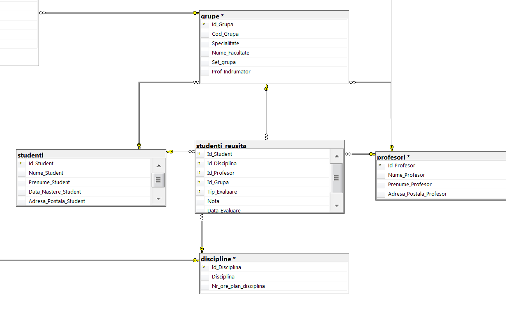
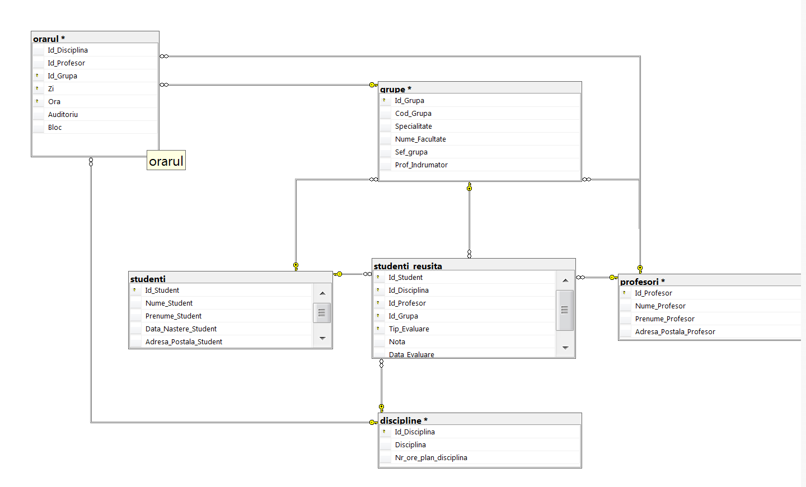
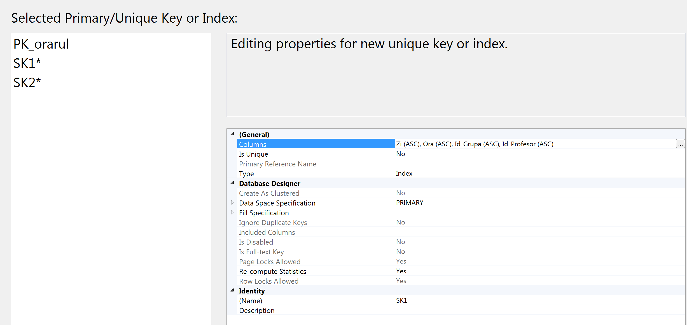

# Lab 7

## Task 1
Database Diagram , for creating this , we just access from Management Studio the Database Diagrams folder -> right click -> New Diagram -> select the needed tables.

## Task 2
In this task we can manually do the refereces constraints. Just Select the field and keep pressed till the needed field from another table.

## Task 3, 5

## Task 4

## Task 6-8
See the code in src
