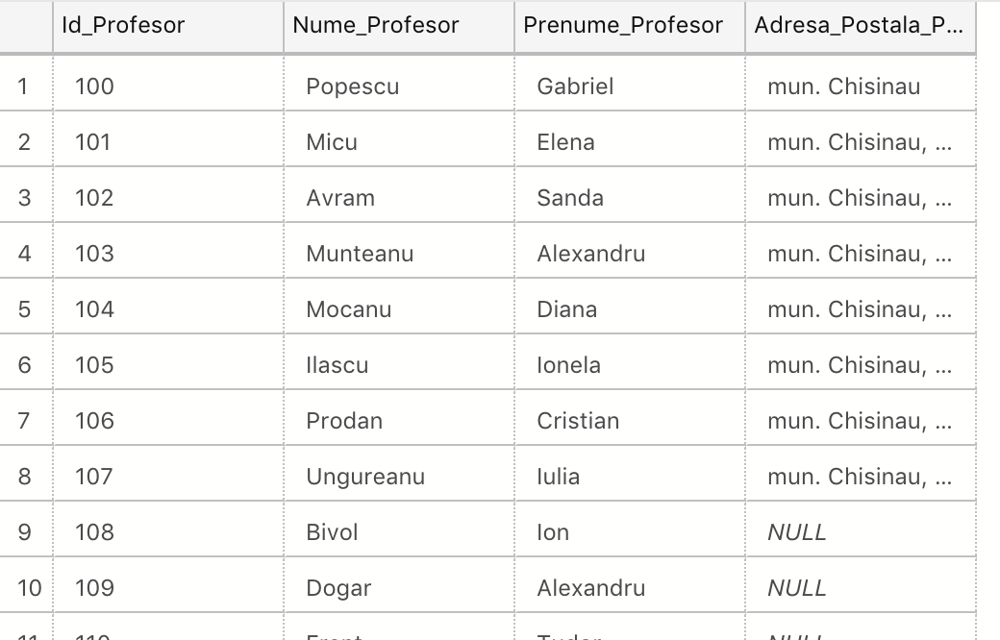
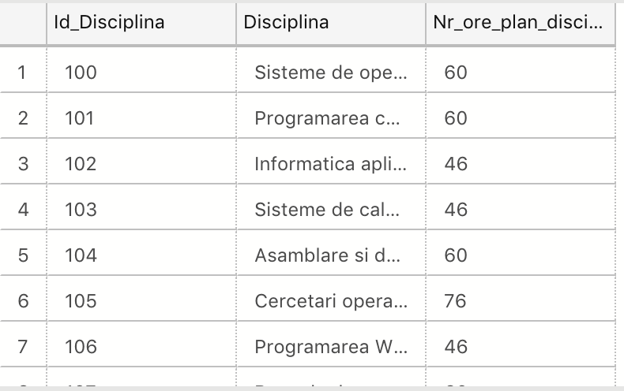
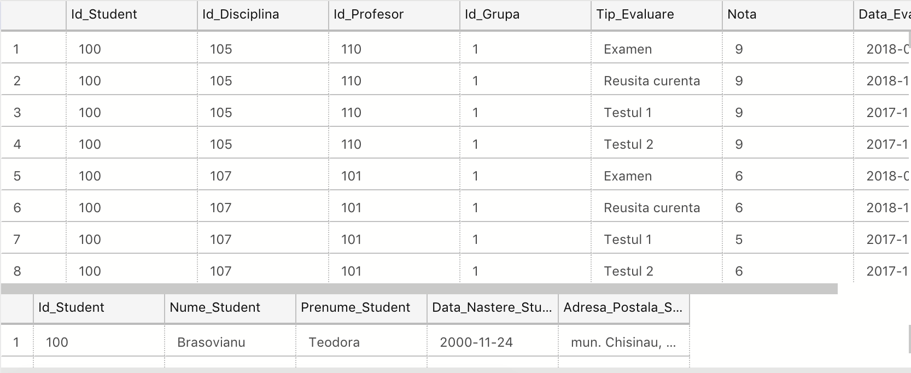
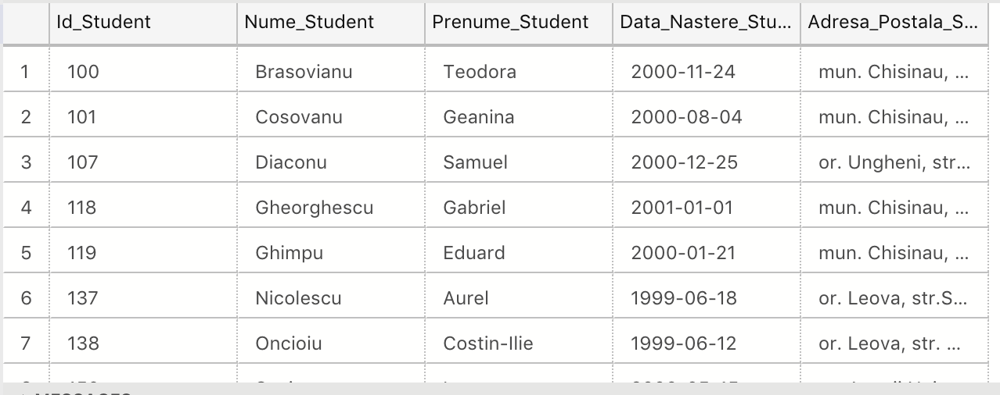
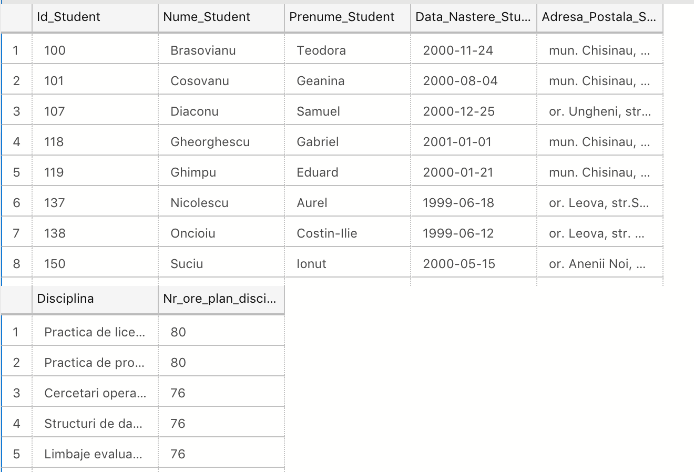

# Lab 7

## Task 1
Create a database diagram, using the standard form of vizualization, structure which is described at the beginning practice items in 4 chapter.

## Task 2
Add the references constraints ( for studenti and profesori tables) needed 'Sef_Grupa', 'Prof_Indrumator' columns from grupe table.

## Task 3, 5
At the performed diagram, should to add orarul table. Table orarul contains the 'disciplinei' identifier (Id_Disciplina), profesor's identifier(Id_Profesor) and study block (Bloc). Table key is formed by fields: Id_Grupa, Zi, Ora, Auditoriu. In the diagram should be added the PK-FK for Id_Disciplina, Id_Profesor, Id_Grupa attributes from orarul table with those attributes from tables.

## Task 4
Orarul table should contains 2 secondary keys: (Zi, Ora, Id_Grupa, Id_Profesor), (Zi, Ora, Id_Grupa, Id_Disciplina).

## Task 6
Create 3 schemas : cadre_didactice, plan_studii, studenti. Transfer profesori from dbo schema to 'cadre_didactice' schema, discipline to 'plan_studii', studenti and studenti_reusita to 'studenti'. Write the needed SQL instructions.

### Task 6.1

### Task 6.2

### Task 6.3

## Task 7
Modify the 2-3 queries from chapter 4 on the 'universitatea' database for explicitly addressing at the tables, taking into account that tables are in the new schemas.

## Task 8
Create synonyms to simplify the queries performed in the previous item and use them.

