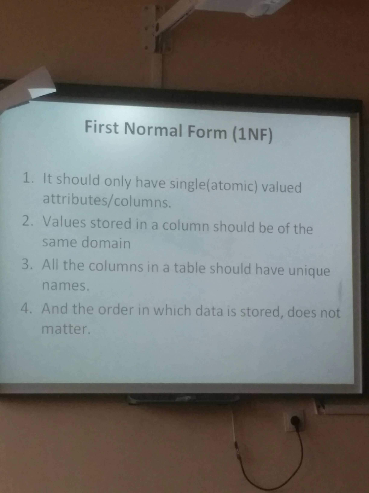
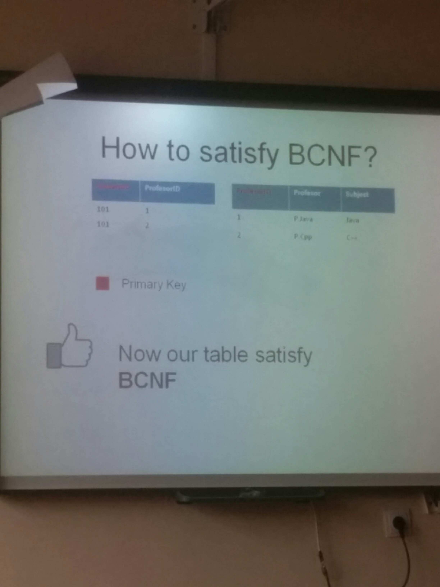

# First normal form

1. No values separated through commas.

# Second Normal Form (2NF)

1. The tables should be in the First Normal Form.
2. There should be no Partial Dependency.

## What is Partial Dependency?
All ID columns must define a single instance.

~~~
ScoreID | StudentID | SubjectID | Mark | Teacher
--------+-----------+-----------+------+---------
001     | 001       | 001       | 70   | CTeacher
~~~

In this case, Teacher is defined by SubjectID and not StudentID, so Teacher is partial dependent.

# Third Normal Form (3NF)
1. -
2. It should not have Transitive Dependency.

If A > B and B > C then A > C.

U want to add ExamName and MarkPercentage to ScoreID.

ExamName does depend on StudentID and SubjectID but MarkPercentage depends only on ExamName. So MarkPercentage depends indirectly on StudentID and SubjectID. So u put ExamName and MarkPercentage into a different table... This is very confusing.

# Boyce-Codd Normal Form or 3.5 NF
~~~
StudentID | Subject | Prof
101       | Java    | P.Java
~~~

Prof -> Subject... but Prof is not a primary key...

How to solve it:

# Fourth Normal form
Multi dependency

~~~
   <- B
A
   <- C
~~~

But tables should have at least 3 columns. Don't overengineer it, really.

Bad:
~~~
StudentID | Course | Hobby
~~~

A good way:
~~~
CourseID | StudentID | Course

HobbyID | StudentID | Hobby
~~~

Because, if u have something like:
~~~
StudentID | Course  | Hobby
          | IT      | Cricket
          | IT      | Fapping
          | Math    | Football
~~~

Then it doesn't make any sense.
